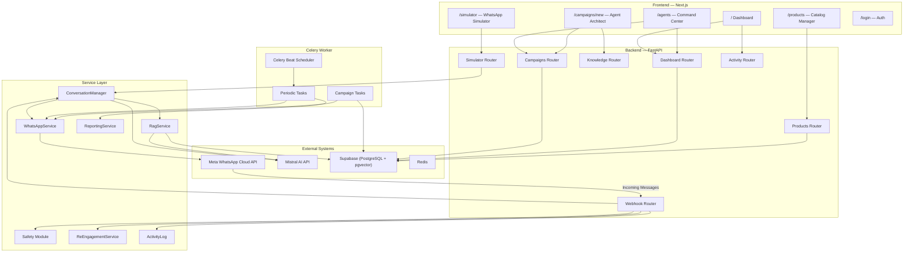
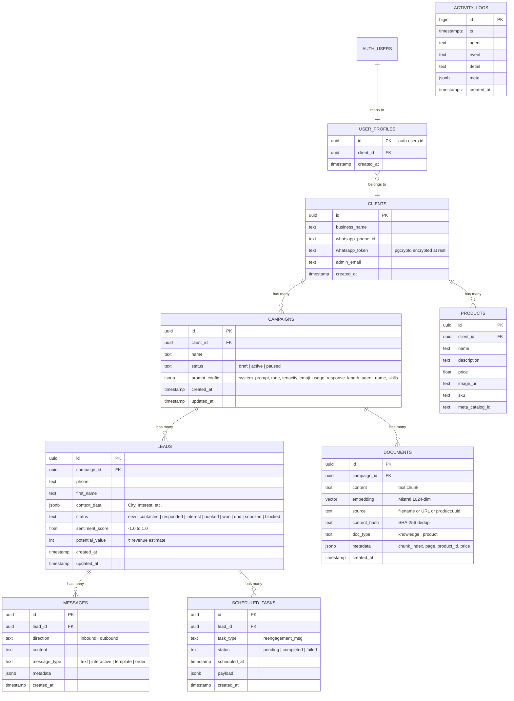
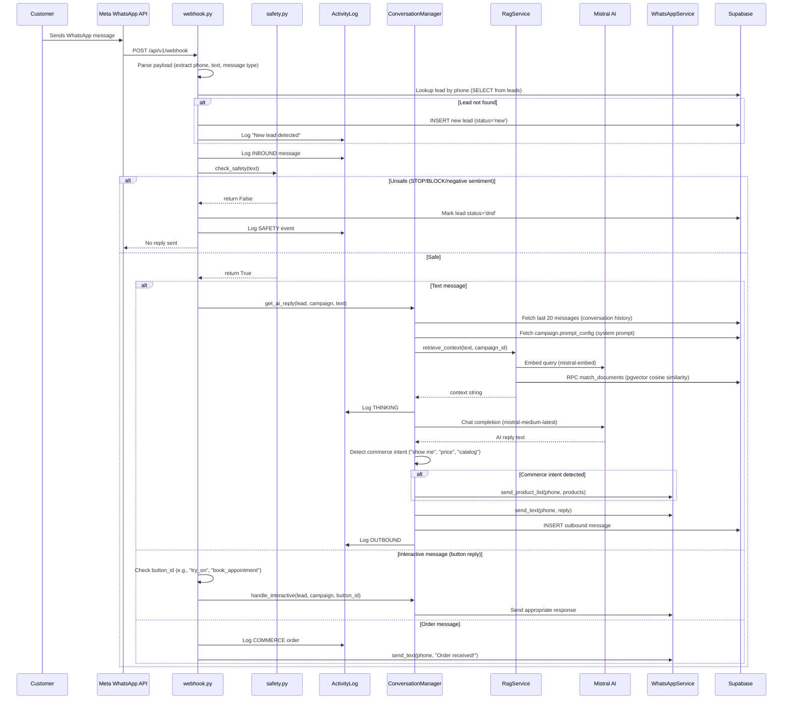
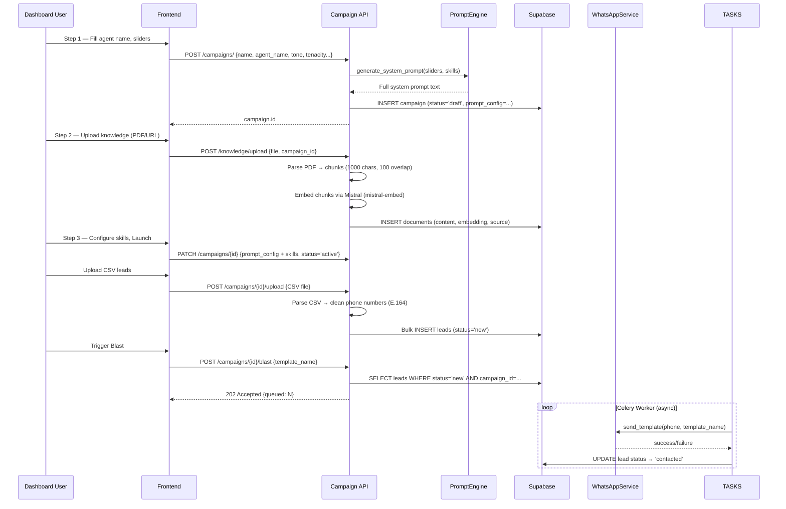
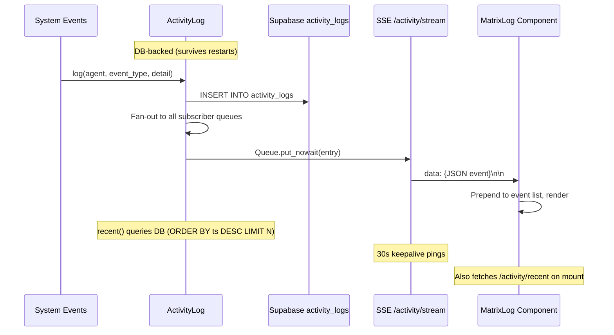
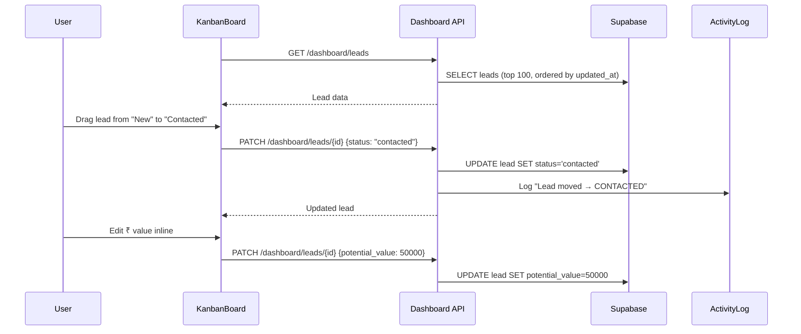

# Revive — Complete Architecture Analysis

> **Revive** is an AI-powered WhatsApp re-engagement platform for jewelry retailers. It automates customer outreach, manages sales pipelines, and enables commerce — all through WhatsApp, powered by Mistral AI with RAG capabilities.

---

## Tech Stack

| Layer | Technology |
|---|---|
| **Backend API** | Python · FastAPI · Pydantic |
| **Task Queue** | Celery + Redis (broker & backend) |
| **Database** | PostgreSQL (Supabase) + pgvector + pgcrypto |
| **AI Engine** | Mistral AI (`mistral-medium-latest` for chat, `mistral-embed` for embeddings) |
| **Messaging** | WhatsApp Business Cloud API (Meta) |
| **Frontend** | Next.js 14 · React · TypeScript · Tailwind CSS |
| **Auth** | Supabase Auth (Google OAuth + email/password) |
| **Storage** | Supabase Storage (product images) |
| **NLP/Safety** | VADER Sentiment Analysis · keyword blocklist |
| **Security** | Tenant-isolated RLS · pgcrypto token encryption · `html.escape` CSV sanitization |
| **Testing** | pytest + httpx |

---

## System Architecture



---

## Database Schema

Eight tables in Supabase PostgreSQL, with tenant-isolated RLS policies on all:



### Key Schema Details

- **`prompt_config` (JSONB)** — Stores the full AI personality config: system prompt, 4 slider values (tone, tenacity, emoji, length), agent name, and skills (appointment booking, discount authority, human handoff, image gen, catalog)
- **`context_data` (JSONB)** — Freeform lead metadata from CSV import (city, interest, purchase history, etc.). All values are `html.escape()`d on ingestion to prevent XSS
- **`documents`** — Vector store for RAG. Uses pgvector extension with HNSW index. Has a `match_documents` RPC function for cosine similarity search. Stores both knowledge chunks (`doc_type='knowledge'`) and product embeddings (`doc_type='product'`). Content hash for dedup
- **`potential_value`** — Revenue tracking per lead; displayed on Kanban cards and aggregated by pipeline-stats endpoint
- **`user_profiles`** — Maps `auth.uid()` to `client_id` for multi-tenant isolation. Used by `get_my_client_id()` SQL function in all RLS policies
- **`activity_logs`** — Persistent activity log table; replaces in-memory ring buffer. Indexed on `ts DESC`
- **`whatsapp_token`** — Encrypted at rest using pgcrypto PGP symmetric encryption via `encrypt_token()` / `decrypt_token()` RPC functions

---

## Backend Architecture

### File Map

```
backend/app/
├── main.py                          # FastAPI app, CORS, 7 routers, global error handlers, startup seed
├── core/config.py                   # Settings (env vars: SUPABASE_SERVICE_KEY, CORS_ORIGINS, ENCRYPTION_KEY)
├── db/
│   ├── supabase.py                  # Supabase client (prefers service_role key)
│   ├── schema.sql                   # DDL (reference, not auto-applied)
│   └── migrations/                  # DB migrations (user_profiles, RLS, pgcrypto, activity_logs, status constraint)
├── api/endpoints/
│   ├── webhook.py                   # WhatsApp webhook (GET verify + POST handler)
│   ├── campaigns.py                 # CRUD + CSV upload + async blast trigger (202 Accepted)
│   ├── dashboard.py                 # Stats + leads CRUD + pipeline-stats
│   ├── products.py                  # CRUD + image upload to Supabase Storage
│   ├── knowledge.py                 # File/URL ingest + list sources + delete
│   ├── simulator.py                 # Stateless conversation testing
│   └── activity.py                  # SSE stream + REST recent events
├── services/
│   ├── conversation.py              # AI reply orchestrator (Mistral + RAG + tools)
│   ├── whatsapp.py                  # WhatsApp Cloud API client
│   ├── rag.py                       # PDF/URL/DOCX ingest + smart chunking + vector search + MMR re-ranking
│   ├── product_embedder.py           # Product → vector embedding pipeline
│   ├── safety.py                    # VADER sentiment + keyword blocklist
│   ├── reengagement.py              # Snooze detection + scheduled follow-ups (status → snoozed)
│   ├── reporting.py                 # Daily stats (interest/won) + briefing message formatter
│   └── activity.py                  # DB-backed activity log (Supabase) + SSE broadcast
├── utils/
│   ├── prompt_engine.py             # Slider values → system prompt generator
│   ├── csv_parser.py                # CSV/Excel → sanitized (html.escape) lead records
│   ├── crypto.py                    # encrypt_token/decrypt_token via pgcrypto RPC
│   └── whatsapp_builder.py          # WhatsApp interactive message payloads
├── tasks/
│   └── periodic.py                  # Celery tasks (morning briefing, scheduled reengagement)
├── tasks.py                         # Campaign blast task (rate-limited, service_role key)
├── worker.py                        # Celery app config + Beat schedule
├── pytest.ini                       # Test runner config (testpaths: TESTS/)
└── TESTS/                           # Test suite (pytest discovery)
```

### API Endpoints

| Route | Method | Handler | Purpose |
|---|---|---|---|
| `/api/v1/webhook` | GET | `verify_webhook` | Meta webhook subscription verification |
| `/api/v1/webhook` | POST | `handle_webhook` | Process inbound WhatsApp messages |
| `/api/v1/campaigns/` | POST | `create_campaign` | Create campaign with generated system prompt |
| `/api/v1/campaigns/` | GET | `list_campaigns` | List all campaigns (filterable by client) |
| `/api/v1/campaigns/{id}` | PATCH | `update_campaign` | Update prompt_config / status |
| `/api/v1/campaigns/{id}/stats` | GET | `get_campaign_stats` | **[NEW]** Real-time agent metrics (convos, revenue) |
| `/api/v1/campaigns/{id}/upload` | POST | `upload_leads` | CSV/Excel bulk lead import |
| `/api/v1/campaigns/{id}/blast` | POST | `trigger_blast` | Async blast via Celery — returns 202 Accepted |
| `/api/v1/dashboard/stats` | GET | `get_dashboard_stats` | Total leads, active convos, won, response rate |
| `/api/v1/dashboard/leads` | GET | `get_dashboard_leads` | Leads for Kanban board (limit 100) |
| `/api/v1/dashboard/leads/{id}` | PATCH | `update_lead` | Update status/potential_value/name/phone |
| `/api/v1/dashboard/pipeline-stats` | GET | `get_pipeline_stats` | Per-stage revenue totals |
| `/api/v1/products/` | GET/POST | `list/create_product` | Product catalog CRUD |
| `/api/v1/products/{id}` | PATCH/DELETE | `update/delete_product` | Product updates |
| `/api/v1/products/upload-image` | POST | `upload_product_image` | Upload to Supabase Storage |
| `/api/v1/knowledge/upload` | POST | `upload_file` | Ingest PDF/TXT/DOCX for RAG |
| `/api/v1/knowledge/scrape` | POST | `scrape_url` | Ingest URL content for RAG |
| `/api/v1/knowledge/{campaign_id}` | GET | `list_knowledge_sources` | List ingested sources |
| `/api/v1/knowledge/delete-source` | POST | `delete_source` | Remove RAG source + chunks |
| `/api/v1/simulate` | POST | `simulate_conversation` | Stateless AI conversation test |
| `/api/v1/activity/recent` | GET | `get_recent_activity` | Last 50 activity log entries |
| `/api/v1/activity/stream` | GET | `stream_activity` | SSE real-time event stream |

---

## Core Data Flows

### 1. Inbound WhatsApp Message → AI Reply

This is the primary runtime flow — the beating heart of Revive:



### 2. Campaign Creation → Blast Execution



### 3. The Matrix — Real-Time Activity Log



### 4. Kanban Pipeline — Drag & Drop



---

## Service Deep Dives

### ConversationManager ([conversation.py](file:///Users/walpurgis/Desktop/AR/revive/backend/app/services/conversation.py))

The AI brain. Orchestrates multi-step reply generation:

1. **Fetch history** — Last 20 messages from Supabase for the lead
2. **Get system prompt** — From campaign's `prompt_config.system_prompt`
3. **RAG context** — Embeds user query, runs pgvector similarity search, injects matching chunks
4. **Generate reply** — Calls Mistral `mistral-medium-latest` with system prompt + history + RAG context
5. **Semantic product search** — Searches product embeddings via `rag.retrieve_products` (semantic vector similarity, replaces regex keyword matching)
6. **Interactive tools** — Handles button IDs like `try_on`, `book_appointment` with special responses
7. **Stores messages** — Persists both inbound and outbound messages to DB
8. **Also has `simulate_reply`** — Stateless version for the Simulator page (no DB, no RAG)

### RagService ([rag.py](file:///Users/walpurgis/Desktop/AR/revive/backend/app/services/rag.py))

Knowledge base and product vector store for context-aware replies:

- **Ingest file** — Reads PDF (with `[PAGE N]` markers), DOCX (via `python-docx`), or plain text → sentence-aware chunking (`_smart_chunk`with 2-sentence overlap) → embeds via `mistral-embed` → stores in `documents` table with pgvector. SHA-256 content hash dedup prevents re-ingestion
- **Ingest URL** — robots.txt compliance check → scrapes with `requests` + `BeautifulSoup` → same chunking pipeline
- **Retrieve context** — Embeds query → calls `match_documents` RPC (configurable threshold from `prompt_config.rag_threshold`, 3x over-fetch) → filters to `knowledge` docs → MMR diversity re-ranking (`_mmr_rerank`) → returns source-attributed context `[Source: file.pdf | Relevance: 0.85]`
- **Retrieve products** — Embeds query → `match_documents` with 0.5 threshold → filters to `product` docs → fetches full product records from `products` table

### ProductEmbedder ([product_embedder.py](file:///Users/walpurgis/Desktop/AR/revive/backend/app/services/product_embedder.py))

Converts product catalog entries into vector embeddings stored in `documents` table with `doc_type='product'`:

- **`embed_product`** — Converts product fields (name, price, description, SKU) to text → embeds → upsert pattern (delete old + insert new)
- **`embed_all_products`** — Batch embeds all products for a client into a campaign's vector store
- **`remove_product`** — Cleans up vector store on product deletion

### PromptEngine ([prompt_engine.py](file:///Users/walpurgis/Desktop/AR/revive/backend/app/utils/prompt_engine.py))

Converts 4 slider values (0–100) into natural language instructions:

| Slider | Low (0–30) | Medium (30–70) | High (70–100) |
|---|---|---|---|
| **Tone** | "Extremely Formal. Use Sir/Ma'am" | "Friendly and Professional" | "Casual and Gen-Z. Use slang" |
| **Tenacity** | "Zero Pressure. Don't push" | "Consultative. Gently nudge" | "Aggressive Closer. Create urgency" |
| **Emoji** | "Do NOT use emojis" | "Use sparingly" | "Overload! 2-3 per sentence ✨💍💖" |
| **Length** | "Under 20 words. Rapid fire" | "Balanced. Clear but concise" | "Detailed and flowery. Tell a story" |

Also appends skill instructions (appointment booking link, discount max %, human handoff, virtual try-on) and core safety rules (no hallucinated inventory, no discounts >20%, anger → escalate).

### Safety Module ([safety.py](file:///Users/walpurgis/Desktop/AR/revive/backend/app/services/safety.py))

Two-layer safety check:

1. **Keyword blocklist** — STOP, UNSUBSCRIBE, BLOCK, SPAM, REPORT → auto-DND
2. **VADER sentiment** — Compound score < -0.5 → auto-DND

When triggered: lead status → `dnd`, no reply sent, event logged to The Matrix.

### WhatsAppService ([whatsapp.py](file:///Users/walpurgis/Desktop/AR/revive/backend/app/services/whatsapp.py))

Full WhatsApp Business Cloud API client supporting:

- `send_template(phone, template_name)` — Pre-approved Meta templates
- `send_text(phone, message)` — Plain text messages
- `send_interactive(phone, payload)` — Button/list interactive messages
- `send_product_list(phone, products)` — Multi-Product Message (MPM) carousel

Uses `httpx.AsyncClient` for all API calls. Phone cleaning utility strips non-digits and prepends country code.

### ReEngagementService ([reengagement.py](file:///Users/walpurgis/Desktop/AR/revive/backend/app/services/reengagement.py))

- **Snooze detection** — Regex for "not now", "later", "busy", "next month", etc.
- **Schedule follow-up** — Inserts a `scheduled_tasks` row (default: 30 days out) with a payload message
- **Status update** — Marks lead as `snoozed` (validated by DB CHECK constraint)
- **Execution** — Handled by Celery Beat's hourly `process_scheduled_tasks` task

### ReportingService ([reporting.py](file:///Users/walpurgis/Desktop/AR/revive/backend/app/services/reporting.py))

Daily stats engine:

- **Active conversations** — Leads with status `contacted`, `responded`, or `interest` (updated in last 24h)
- **Won/Booked** — Leads with status `booked` or `won` (updated in last 24h)
- **Action items** — Leads with status `responded` or `interest` (need human follow-up)
- **Briefing formatter** — Generates WhatsApp-friendly message with emojis for daily admin briefing

### ActivityLog ([activity.py](file:///Users/walpurgis/Desktop/AR/revive/backend/app/services/activity.py))

"The Matrix" — persistent real-time operations log:

- **DB-backed** — Events persisted to `activity_logs` Supabase table (survives restarts)
- **Event types** — `INBOUND`, `THINKING`, `OUTBOUND`, `SYSTEM`, `COMMERCE`, `SAFETY`, `ERROR`
- **Fan-out** — New entries broadcast to all SSE subscriber `asyncio.Queue`s for real-time dashboard
- **`recent(n)`** — Queries DB (`ORDER BY ts DESC LIMIT n`), returns oldest-first
- **`log_sync`** — Synchronous wrapper for use in non-async contexts (e.g., Celery tasks)

---

## Frontend Architecture

### Pages

| Route | Component | Purpose |
|---|---|---|
| `/` | `DashboardPage` | Command Center: stats cards, Kanban board, The Matrix |
| `/agents` | `AgentsPage` | **[NEW]** Agent Command Center: grid view, status toggle, edit mode |
| `/campaigns/new` | `NewCampaignPage` | 3-step Agent Architect wizard |
| `/agents/[id]/edit` | `EditAgentPage` | **[NEW]** Agent Architect in "Edit Mode" (pre-filled) |
| `/products` | `ProductsPage` | Catalog Manager with card grid + modal |
| `/simulator` | `SimulatorPage` | iPhone-styled WhatsApp conversation tester |
| `/login` | `LoginPage` | Supabase Auth UI (Google + email) |
| `/auth/callback` | `route.ts` | OAuth code → session exchange |

### Key Components

| Component | Location | Features |
|---|---|---|
| `KanbanBoard` | [KanbanBoard.tsx](file:///Users/walpurgis/Desktop/AR/revive/frontend/components/dashboard/KanbanBoard.tsx) | 5-stage pipeline, drag-and-drop (`@hello-pangea/dnd`), inline ₹ editing, per-column revenue, sentiment dots |
| `AgentCard` | `AgentCard.tsx` | **[NEW]** Glass-morphic card with avatar, status toggle, and sparkline stats |
| `AgentStatsGrid` | `AgentStatsGrid.tsx` | **[NEW]** Aggregated metrics for the Agent Command Center |
| `MatrixLog` | [MatrixLog.tsx](file:///Users/walpurgis/Desktop/AR/revive/frontend/components/dashboard/MatrixLog.tsx) | SSE-powered real-time event log, LIVE/OFFLINE indicator |
| `TiltCard` | `TiltCard.tsx` | 3D tilt effect stat cards |
| `Speedometer` | `Speedometer.tsx` | Response rate gauge |
| `PersonaSlider` | `PersonaSlider.tsx` | Labeled slider with left/right labels and description |
| `KnowledgeBase` | `KnowledgeBase.tsx` | File/URL upload for RAG training |
| `SkillStore` | `SkillStore.tsx` | Skill toggle cards with configs |
| `ProductCard` | `ProductCard.tsx` | Product display card with delete |
| `ProductModal` | `ProductModal.tsx` | Create product form with image upload |

### Auth Flow

1. User visits `/login` → Supabase Auth UI renders (Google OAuth + email/password)
2. Google OAuth redirects to `/auth/callback`
3. `route.ts` exchanges code for session via `supabase.auth.exchangeCodeForSession`
4. `middleware.ts` runs on every request to refresh/validate session via `updateSession`

---

## Celery Worker & Scheduled Tasks

```
worker.py  →  Celery app (broker: Redis)
               ├── include: [app.tasks, app.tasks.periodic]
               ├── timezone: Asia/Calcutta
               └── Beat schedule:
                   ├── "morning-briefing-9am"  →  crontab(hour=9, minute=0) daily
                   └── "reengagement-hourly"   →  crontab(minute=0) every hour
```

### Task: `send_morning_briefing`
1. Calls `reporting_service.get_daily_stats()` — queries last 24h leads/conversations/bookings
2. Formats into WhatsApp-friendly message with emojis
3. Sends to `ADMIN_PHONE_NUMBER` via WhatsApp

### Task: `process_scheduled_tasks`
1. Queries `scheduled_tasks` WHERE status='pending' AND scheduled_at <= NOW
2. For each: sends the payload message to the lead's phone via WhatsApp
3. Marks as 'completed' or 'failed'

### Task: `send_campaign_task`
- Rate-limited (10/minute per worker)
- Verifies lead status isn't already dnd/contacted
- Sends template via WhatsApp → updates lead to 'contacted'
- Auto-retry on failure (60s for DB errors, 300s for WhatsApp errors)

---

## Environment Configuration

```
SUPABASE_URL          # Supabase project URL
SUPABASE_KEY          # Supabase anon key (frontend + fallback)
SUPABASE_SERVICE_KEY  # Supabase service_role key (backend — bypasses RLS)
CORS_ORIGINS          # Comma-separated allowed origins (default: http://localhost:3000)
ENCRYPTION_KEY        # Symmetric key for pgcrypto token encryption
WEBHOOK_VERIFY_TOKEN  # Meta webhook subscription verification
WHATSAPP_PHONE_ID     # WhatsApp Business Phone Number ID
WHATSAPP_TOKEN        # WhatsApp Cloud API access token
MISTRAL_API_KEY       # Mistral AI API key
REDIS_URL             # Redis for Celery (default: localhost:6379/0)
ADMIN_PHONE_NUMBER    # Recipient for morning briefing
```

---

## Security Model

| Layer | Mechanism |
|---|---|
| **Multi-Tenancy** | `user_profiles` table maps `auth.uid()` → `client_id`; `ClientProvider` React context resolves dynamically |
| **RLS** | Tenant-isolated policies on all tables via `get_my_client_id()` SQL helper; 21 policies across 8 tables |
| **Token Encryption** | `whatsapp_access_token` encrypted at rest via pgcrypto PGP symmetric encryption (`encrypt_token` / `decrypt_token` RPC) |
| **CORS** | Configurable via `CORS_ORIGINS` env var; defaults to `http://localhost:3000` |
| **Webhook** | Verify token (`hub.verify_token`) for Meta subscription |
| **Auth** | Supabase Auth (JWT sessions, Google OAuth) |
| **Content Safety** | VADER sentiment + keyword blocklist → auto-DND |
| **CSV Sanitization** | All CSV string inputs `html.escape()`d before JSONB storage to prevent XSS |
| **Error Handling** | Global exception handlers return structured JSON; stack traces logged server-side only |
| **Rate Limiting** | Celery task rate_limit (10/min per worker) |
| **Backend Auth** | Service role key (`SUPABASE_SERVICE_KEY`) used for backend operations; bypasses RLS |

---

## Current Project State

### What's Built & Working

- ✅ **Full WhatsApp webhook pipeline** — Receive messages, generate AI replies, send responses
- ✅ **AI conversation engine** — Mistral-powered with RAG context injection
- ✅ **RAG knowledge base** — PDF/URL ingestion with pgvector similarity search
- ✅ **Campaign management** — Create, configure, upload leads, trigger blasts
- ✅ **5-stage Kanban pipeline** — Drag-and-drop with revenue tracking
- ✅ **The Matrix** — DB-persistent real-time SSE activity log with 7 event types
- ✅ **Product catalog** — CRUD with image upload to Supabase Storage
- ✅ **WhatsApp commerce** — Multi-product messages, interactive buttons/lists, order handling
- ✅ **Safety system** — Sentiment + keyword → auto-DND
- ✅ **Re-engagement scheduling** — Snooze detection → scheduled follow-ups (status: `snoozed`)
- ✅ **Celery background tasks** — Morning briefing, hourly re-engagement, async campaign blasts
- ✅ **Agent Architect** — 3-step wizard (persona sliders → knowledge → skills)
- ✅ **WhatsApp Simulator** — iPhone-styled testing interface
- ✅ **Supabase Auth** — Google OAuth + email login with middleware session management
- ✅ **Dashboard** — Stats cards, Speedometer, Kanban, Matrix — all live data
- ✅ **Agent Command Center** — `/agents` page with grid view, status toggle, edit mode
- ✅ **RAG Pipeline v2** — Sentence-aware chunking, HNSW index, MMR re-ranking, source attribution, content dedup, DOCX support
- ✅ **Product Vector Search** — Semantic product retrieval replaces regex commerce detection
- ✅ **Multi-tenant isolation** — Dynamic `client_id` via `user_profiles` + `ClientProvider`
- ✅ **Tenant-isolated RLS** — 21 policies across 8 tables using `get_my_client_id()`
- ✅ **CORS hardening** — Configurable via `CORS_ORIGINS` env var
- ✅ **Token encryption** — pgcrypto PGP symmetric encryption for WhatsApp tokens
- ✅ **Async campaign blasts** — Celery task dispatch, returns 202 Accepted
- ✅ **Persistent activity logs** — `activity_logs` Supabase table (survives restarts)
- ✅ **CSV sanitization** — `html.escape()` on all imported string values
- ✅ **Reporting service** — Updated to use `interest`/`won` statuses
- ✅ **Status constraint** — `leads.status` expanded to 9 values including `snoozed`, `blocked`
- ✅ **Global error handling** — Structured JSON for HTTP, validation, and unhandled exceptions
- ✅ **Testing setup** — pytest + httpx configured with `TESTS/` directory

### Known Gaps / Next Steps

- ⬜ **Production deployment** — Environment is localhost-only; needs hosting config
- ⬜ **Test coverage** — Test suite exists but tests require running server; convert to `TestClient` for CI
- ⬜ **Monitoring / Alerting** — No APM, error tracking, or uptime monitoring
